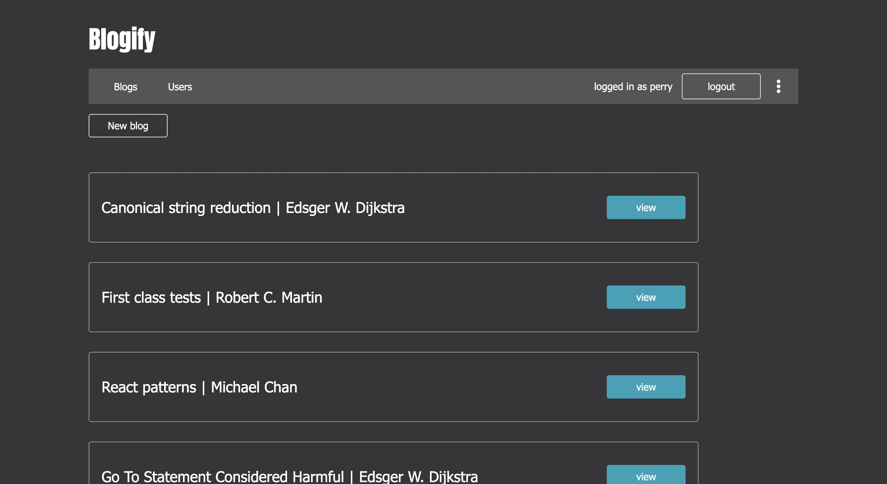
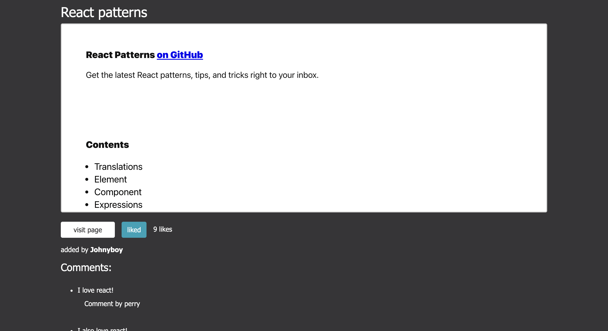

<a href="https://blogify-app-v1.herokuapp.com/" target="_blank"><h1 align="center">Blogify</h1></a>

<h4 align="center">A blog forum application built as a part of <a href="https://fullstackopen.com/en/" target="_blank">Full Stack Open</a></h4>

---

## Feature Overview

- Account creation and authentication
- Persistant sessions
- Users can post blogs with a url link to it, a title, and an author
- Users can comment on and like different blogs
- Blogs with the most likes are at the top of the feed
- Light mode and dark mode

## Run Locally

1. clone the repo
2. run `npm install` or `yarn install`
3. create a .env file following the .env-template (will need to supply a mongodb connection string of your own)
4. run `npm run db:seed` to populate the database with test data
5. run `npm run dev` for development

## Project Screenshots

## Reflection

**TLDR**
The project was built as the culmination of a MOOC (full stack open) I was going through. The process of creating a full stack app ended up being really enjoyable so I went ahead and added a few extra commonly expected features in modern forum/thread/social web applications.

#### Inspiration

As this project was a part of a course, it's not exactly customer/user experience focused. By that, I mean I don't think any one is in need of a forum to post links to different blogs, but it was a really good experience for me as a developer building it. I ended up extending some of the functionality like adding comments, liking blogs, and choosing a theme to resemble a more real world application.

#### Notable Technologies

- MERN stack
- Mongoose
- Redux
- Redux thunk
- Styled-components

Having previously created a couple small projects using React this projects aim was to be large enough to be able to provide a decent use case for some of the tools listed above.

Having not used Redux or any state management tool before my initial thought was "why would you ever not use this?". It was significantly simpler to share data across the application, and not having to drill props down through your component tree is always a plus. Being able to fetch data within your action creators using Redux Thunk was also a huge bonus. Redux though, like anything else, has it's downsides. It felt a little verbose having to write action creators for every state changing operation, and reading through a long switch statement isn't always pleasant. I think in cases where only a small portion of your application state needs to be shared, using React Context can be a better solution, with Redux being the better choice for very complex state and state sharing requirements.

Using express and mongoose together is probably the simplest and quickest way to get an api with persistant data up and running. With mongoose, no need to worry about knowing SQL or the extra complexity of relations in a relational database, and with express, you can have your REST api up and handling different endpoints in minutes. The unopinionated nature of express is the only downside I experienced at the time. If you don't have a strong architecture or design pattern to follow when building your api the code can get messy quickly.

As for Styled-components, I have nothing but good things to say. You'll have to style all of your elements your self as opposed to using something like bootstrap, but the power and modularity you can achieve is amazing. Particularly when implementing themes.

#### Challenges and Takeaways

Originally, a logged in user could like a blog as many times as they want, which clearly is not going to fly in any real world situation. So I set out to change that, and it was not quite as easy as I'd thought. I wanted the user to have the experience of the like status instantaneously changing on click, and to be able to remove their like as well. You can easily run into the problem of database being wrongfully updated if the user clicks twice or three times quickly. The solution I came up with was to set all of the local state to the new values and then update the database with those values. To add to that, there's the question of how you want to store the likes information in the database in the first place. For a small application like this, you could make anything work really, but I wanted design it in a way that could possibly scale. It's usually important for a user to be able to see everything that they've liked, so I chose to store the list of blogs liked within the users document and just the total number of likes within the blogs document. The likes field in the user document is implemented as a Map with the blog's id as the key and true as the default value. The idea behind this choice was, had the application been large enough to where an infinite scroll for the blog feed was implemented, on each new fetch of blog posts you could easily check to see if those id's are in the users liked field without having to iterate over a list of likes that could get fairly long. All in all implementing the like button like this absolutely took me out of my comfort zone at the time and helped me grow as a developer.

Similar to the original like button, the comment section was lacking as well. User's could comment, but the comments were not connected to the user in any way after storing them in the database. I went with a simple approach to this and created a comment model with a user field and a text field and stored it as an array in the blogs document. This way I was able to show who posted the comment and also allow the user who posted the comment to delete it.

The last extra feature added was the ability to toggle the dark and light theme and for it to persist through sessions. Using the styled components library made the front end part of this relatively easy and getting it to persist was as simple as adding a theme field to the users document.

Looking back part of me wishes I could have the extra time I spent on this application back so that I could put it towards a more usable end product, but it's sometimes hard to think you can actually build something useful when your still relatively new to programming and teaching yourself on top of that. Building this project definitely helped me get past some of that lack of confidence.
